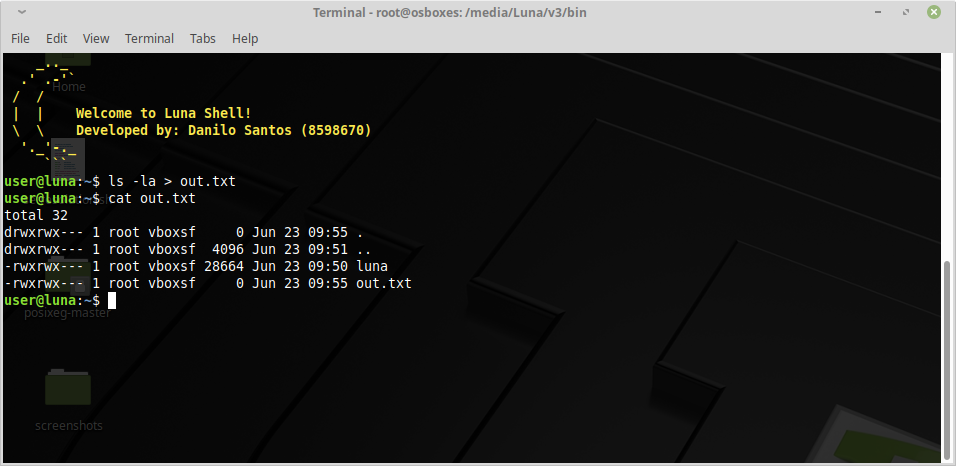
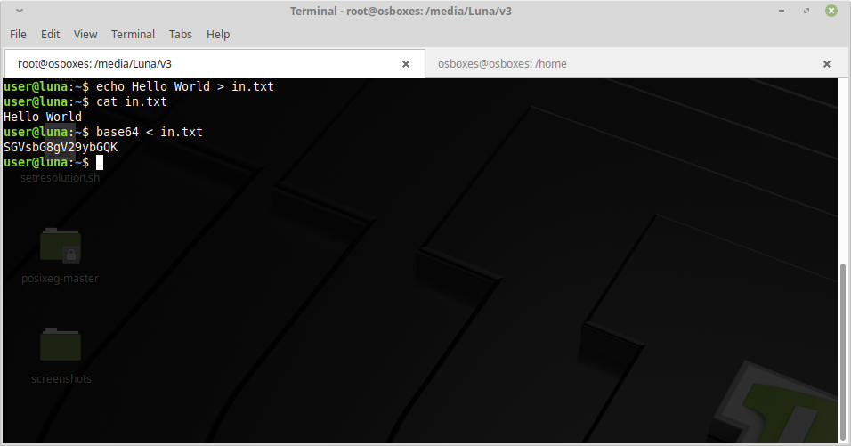
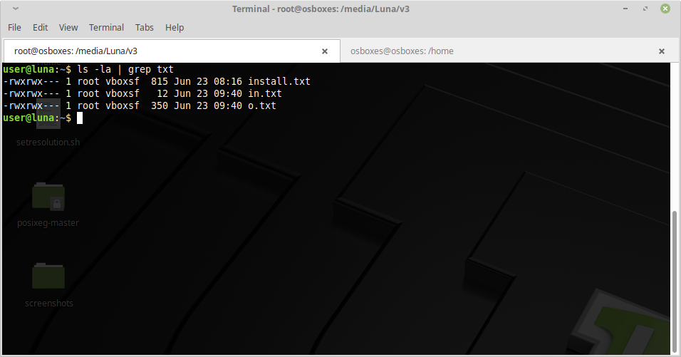
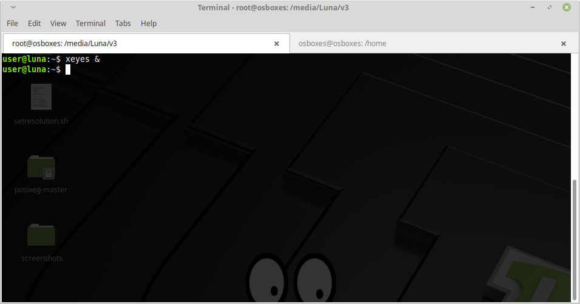
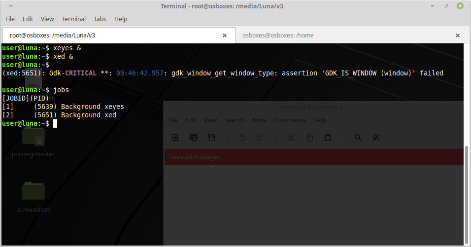
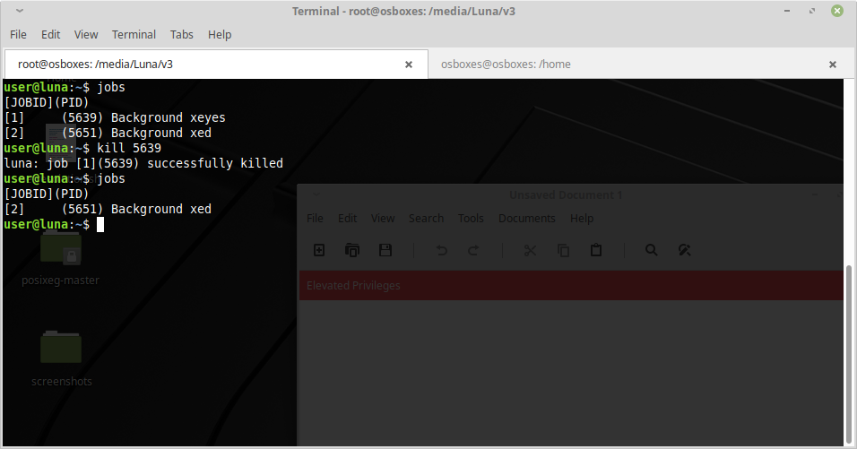

# SO2-Shell
Operational Systems II Project 

<h2>How to build the binary executable</h2>

Inside the main directory, type: <b>make</b>

<h2>How to remove object files after compilation</h2>

Inside the main directory, type: <b>make clean</b>

<h2>How to run the executable file</h2>

Inside the main directory, type:

<ol>
	<li><b>cd bin</b></li>
	<li><b>./luna</b></li>
</ol>

<h2>Features</h2>

<h3>Redirect output of a command to a file (> and >> operators)</h3>

<h3>Redirect input from a file (< and << operators)</h3>

	
<h3>Redirect output of a command to another command (| operator)</h3>

<h3>Execution of background processes</h3>

<h3>Listing current jobs</h3>

<h3>Killing jobs</h3>

